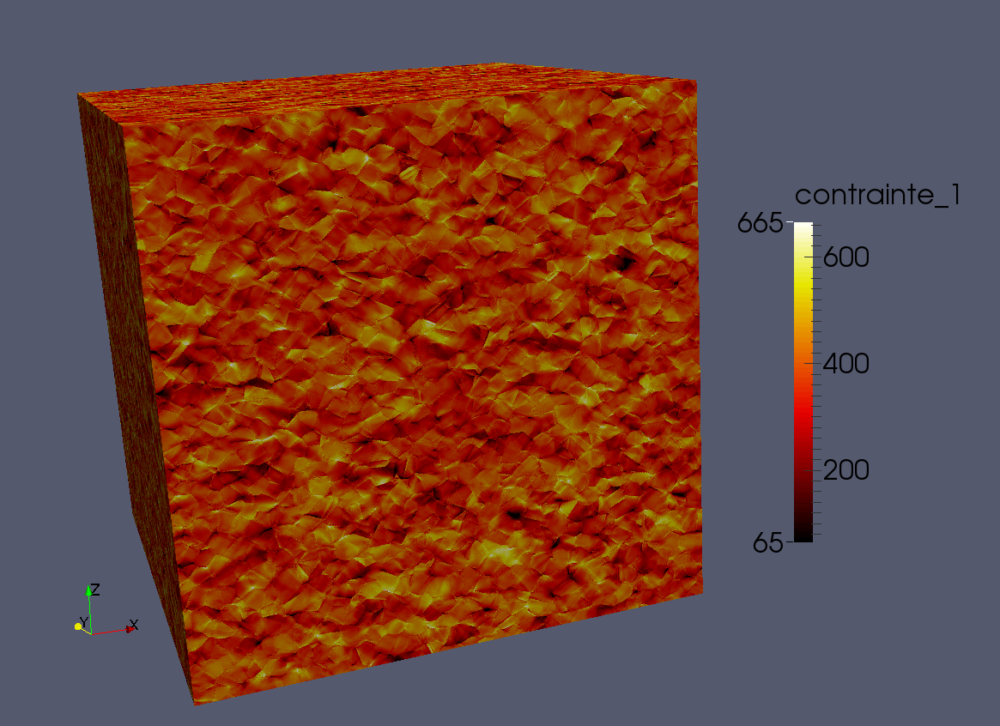

.. title:: Home

Welcome
#######

**AMITEX_FFTP** is a **distributed** solver based on **FFTs** for **non-linear** mechanical simulations on **heterogeneous unit-cells** (discretized by 3D structured meshes). 
One of its main advantages is the possibility to simulate the behavior of a material using
a very fine description. This is made possible because the properties can be distributed on several processes. Here, Figure 1 shows how **AMITEX_FFTP** can be applied to 
compute the strain within a polycrystal using a 1024x1024x1024 resolution (see :ref:`here <example_polyx_mfront>` for more information).

**AMITEX_FFTP** can be executed either on individual PC, local clusters or on large High Performance Computing platforms. 

	      
Figure 1: *Axial stress distribution within a CFC polycrystal (~42000 grains) submitted to a tensile test (1%) - grid resolution 1024x1024x1024 - local behavior : dislocation based crystal plasticity*

Download
========

.. toctree::
   :maxdepth: 1

   download
  
First steps
===========

.. toctree::
   :maxdepth: 1
   
   overview
   install

Run and analyze a simulation
============================

.. toctree::
   :maxdepth: 1

   user
   post

Applications
============================

.. toctree::
   :maxdepth: 1

   examples
   scalability

Tools
============================

.. toctree::
   :maxdepth: 1

   tools

References
============================

.. toctree::
   :maxdepth: 1

   references

FAQ
============================

.. toctree::
   :maxdepth: 1

   FAQ

=======

..   install.rst
..   dev_guide.rst
..   perf.rst

.. Indices and tables
.. ==================

.. * :ref:`genindex`
.. * :ref:`modindex`
.. * :ref:`search`

