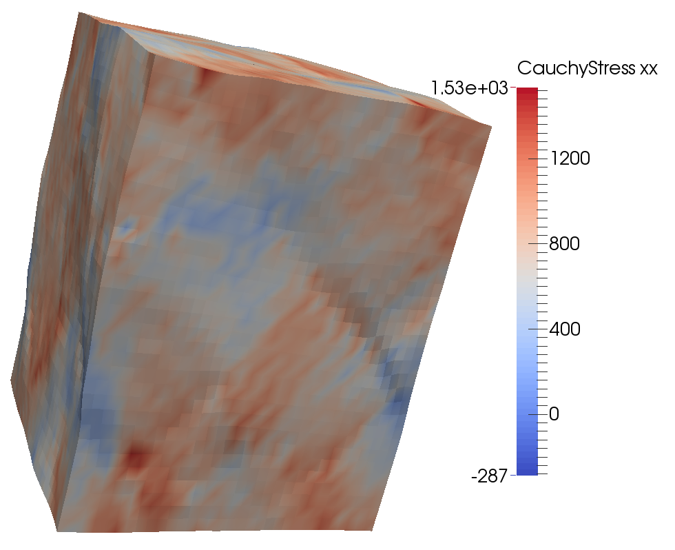

.. _post:

Post-treatment
==============

.. _visu_fields:

Visualizing fields
------------------

When defining a loading, the user can choose the fields to be output (see :ref:`user-loading-outputs`).
This leads to the creation of VTK files, with the *vtk simple legacy format* (http://www.vtk.org/VTK/img/file-formats.pdf), containing the pieces of information requested.
These files can then be visualized and post-treated with *ParaView* (http://www.paraview.org/) or similar visualization tools.

Here is an example of what can be obtained using *ParaView*.

.. figure:: _static/Ex3.png
            :width: 90%

----

.. _visu_deformed_shape:

Visualizing the deformed shape
------------------------------

**Only in the case of finite strains** (*i.e.* when the small perturbations assumption is not used, see :ref:`algorithm-parameters`), it is possible to visualize the fields on the deformed geometry. This can be done using the program *deformedShape* which can be found in the folder *post*/*deformed_shape* and is compiled when the script *install* is executed. This program can be executed through the command ::
  
     ./deformedShape root_in [root_out]

The first parameter is the root of the input file(s) and the second
optional parameter gives the possibility to define the root of the output file.
By default, this root is named *sortie*.
This program will look for the file *root_in_def.vtk* or, if it does not exist,
the files *root_in_defi.vtk* (*i* = 1, ..., 9) in order to retrieve the gradient 
of the displacement. This information allows the computation of the displacement field
leading to the coordinates of each voxel in the deformed configuration. 
The gradient of the displacement is then rewritten using this frame in the file *root_out.vtk*. Moreover, if the files *root_in_sig*
or *root_in_pi* (respectively standing for the Cauchy and Piola-Kirchhoff stress tensors) 
exist, the corresponding variables will also be written in the *root_out.vtk* file.

Here is an example of what can be obtained using *ParaView*.

----

.. _plot:

Plotting results
----------------

The standard output files (*std*, *mstd* and *zstd*, see :ref:`user-loading-outputs`) can directly be used by data plotters (*gnuplot*, *Matlab*, etc.). A precise description of the format is given in the header of each file.

Here are three examples of *gnuplot* commands leading to different plots.

The figure in the case 1 is obtained with the following command in gnuplot: ::

       plot "file.std" u 8:2 w l notitle lw 3

As it is explained in the header of the file, the eighth column corresponds to the strain in the *xx* direction and the second column corresponds to the stress in the same direction.  

The figure in the case 2 is obtained with the following command in gnuplot: ::

       plot "file.mstd" every 2::0 u 8:2 w l notitle lw 3, "file.mstd" every 2::1 u 8:2 w l notitle lw 3

Here, we use the option *every 2::0* and *every 2::1* because there are two materials and we plot the results for the first (number 0) and the second (number 1) material.

The figure in the case 3 is obtained with the following command in gnuplot: ::

       plot for [j=1:1110]  "file_i.zstd" every 1110::j-1 u 1:14 w l notitle lw 3

In this case, there are 1110 zones in the material *i* and we plot the values obtained in each zone. The first column corresponds to the time and the fourteenth column corresponds to the standard deviation of the stress in the *xx* direction. 

**Be careful** the use of *for* loop in *gnuplot* requires the **4.6 version or later**.

In order to obtain an *SVG* image, the following commands must be executed in *gnuplot* before using the command *plot*:::

        set t svg;
  	set o "plot.svg";

The label on the axis and the title of the plot can also be assigned using the commands: ::

        set title "plot name";
        set xlabel "x name";
        set ylabel "y name";

More information about *gnuplot* can be found on the website http://www.gnuplot.info

These three plots exhibit each of the cases that can be obtained:

+------------------------------------------------+
| .. figure:: _static/cycle_polyxCC_Exx_Sxx.svg  |
|    :width: 70%                                 |
|    :align: center                              |
|                                                |
|    Case 1: Global average                      |
+------------------------------------------------+

+-----------------------------------------------------------------------+
| .. figure:: _static/concrete_Exx_Sxx_mat.svg                          |
|    :width: 70%                                                        |
|    :align: center                                                     |
|                                                                       |
|    Case 2: Averages on each material                                  |
+-----------------------------------------------------------------------+

+----------------------------------------------------------+
| .. figure:: _static/concrete_creep_std_zone.svg          |
|    :width: 70%                                           |
|    :align: center                                        |
|                                                          |
|    Case 3: Standard deviations on each zone of a material|
+----------------------------------------------------------+

A *gnuplot* script which outputs three plots in the *SVG* format is available in the folder *post*/*plot*. This script is automatically executed at the end of the validation script (*script_tests.sh*).

